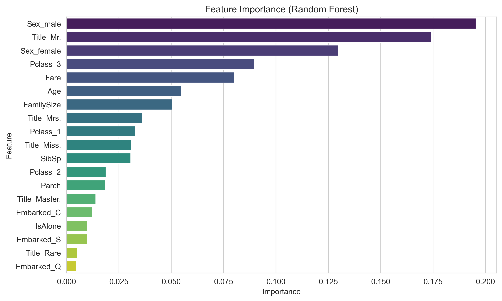

Titanic Survival Analysis

Мой первый проект в Machine Learning. На базе данных Kaggle я предсказал выживаемость пассажиров Титаника, пройдя путь от очистки данных до готовой модели.
Что сделано

    EDA: Анализ пропусков, визуализация распределений и корреляции признаков.

    Feature Engineering: Созданы признаки Title (социальный статус), FamilySize (размер семьи) и IsAlone.

    Preprocessing: Заполнение пропусков (Age, Fare, Embarked) и One-Hot Encoding категориальных данных.

    Моделирование: Обучен Random Forest, точность на валидации — ~82%.

Структура

    data/ — исходные CSV файлы.

    notebooks/ — Jupyter Notebook с полным кодом и выводами.

    src/ — функции предобработки данных.

    models/ — сохраненная модель (.pkl).

    results/ — итоговые предсказания (submission.csv).

    images/ — графики и матрицы ошибок.

Главный вывод

Наибольшее влияние на выживаемость оказали пол, социальный статус (Title) и класс каюты.

Запуск

    pip install -r requirements.txt

    Запустите ноутбук в папке notebooks/.